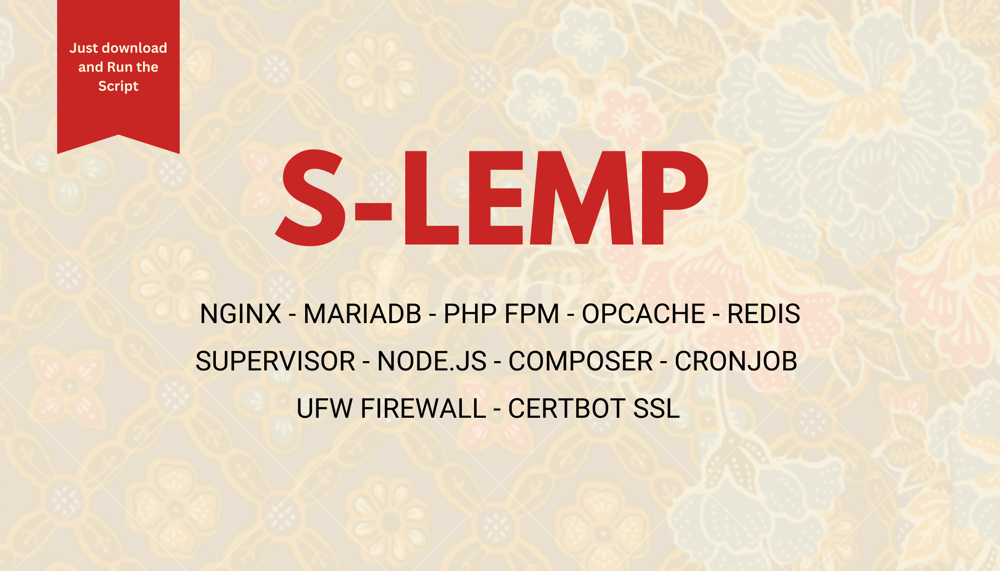

# S-LEMP Stack Installation Scripts for Ubuntu
A complete, production-ready LEMP (Linux, Nginx, MariaDB, PHP) stack installation and removal script specifically optimized for Laravel applications on Ubuntu servers.



## 🚀 Overview
This project provides automated installation and removal scripts for setting up a complete LEMP stack optimized for Laravel development and production environments. The scripts handle complex configuration, security settings, and optimizations needed for a robust Laravel hosting environment.

## 👨‍💻 About
This project was created to solve a problem Sulaiman (the author) and his team repeatedly faced: As developers who don't have a large team to handle Laravel application deployment, how can we simplify and speed up the process of setting up a secure, optimized server environment for Laravel so we can focus on code and technical discussion?

## This project is driven by these goals:
1. **Fast Installation for Laravel Applications**: Streamlined, automated setup that gets Laravel environments running quickly without manual configuration

The broader goals include:
- **Ease of Use**: Simple installation process for developers of all levels
- **Production Ready**: Enterprise-grade security and performance optimizations
- **Flexibility**: Support for different configurations and use cases
- **Reliability**: Comprehensive error handling and recovery mechanisms
- **Open Source**: Community-driven development and continuous improvement

## ✨ Features
### Installation Script (`install.sh`)
- **Interactive Configuration Wizard** - Guided setup with validation
- **Non-Interactive Mode** - Perfect for automation and CI/CD
- **Multiple PHP Versions** - Support for PHP 8.3 LTS and PHP 8.4
- **Queue Management** - Redis or database queue drivers with Supervisor
- **Security Optimized** - Firewall, secure passwords, and hardened configurations
- **SSL Ready** - Certbot integration for Let's Encrypt certificates
- **Performance Tuned** - OPcache, Redis caching, and Laravel optimizations
- **Error Handling** - Comprehensive error recovery and cleanup
- **Helper Scripts** - Laravel permission management and utilities

### Removal Script (`remove.sh`)
- **Complete Uninstallation** - Removes all LEMP components and configurations
- **Safe Removal Process** - Step-by-step removal with confirmations
- **Data Protection** - Warns about data loss and requires explicit confirmation
- **Cleanup Everything** - Removes packages, configs, logs, and temporary files
- **Service Management** - Properly stops and disables all services

## 💻 System Requirements
- **Operating System**: Ubuntu 22.04 LTS or 24.04 LTS
- **Memory**: Minimum 1GB RAM (2GB+ recommended for Laravel applications)
- **Storage**: At least 10GB free space
- **Network**: Internet connection for package downloads
- **Privileges**: Root access (sudo)

## ⚡ Quick Installation
### Fix Any Existing Issues First (If Needed)
If you encounter dpkg lock errors or package management issues, use the removal script to clean up:

```bash
# Run the removal script to clean up any package issues
sudo bash remove.sh

# Then run the installation
sudo bash install.sh
```

### Method 1: Direct Download and Execute

```bash
# Download the installation script
wget https://raw.githubusercontent.com/msulaimanmisri/s-lemp/main/install.sh

# Make it executable
chmod +x install.sh

# Run the installation (interactive mode)
sudo ./install.sh
```

### Method 2: One-Line Installation

```bash
# Download and run in one command (interactive mode)
wget -qO- https://raw.githubusercontent.com/msulaimanmisri/s-lemp/main/install.sh | sudo bash
```

### Method 3: Non-Interactive Installation

```bash
# Download the script
wget https://raw.githubusercontent.com/msulaimanmisri/s-lemp/main/install.sh

# Run in non-interactive mode with defaults
sudo ./install.sh --non-interactive

# Or with custom options
sudo ./install.sh --non-interactive --php-version 8.4 --queue-driver redis
```

## 🔧 Installation Options

### Command Line Arguments

| Option | Description | Values | Default |
|--------|-------------|--------|---------|
| `--non-interactive`, `-n` | Run without prompts using defaults | - | Interactive mode |
| `--php-version` | Choose PHP version | `8.3`, `8.4` | `8.3` |
| `--queue-driver` | Select queue backend | `database`, `redis` | `database` |
| `--help`, `-h` | Show help information | - | - |

### Interactive Mode Configuration
You will be prompted to enter some information. Press Enter to accept the default values shown in brackets.

## 📦 What Gets Installed
### Core Components
- **Nginx** - High-performance web server with optimized configuration
- **MariaDB** - Database server with secure installation
- **PHP** - Version 8.3 or 8.4 with essential Laravel extensions
- **Redis** - In-memory data store for caching and queues
- **Node.js** - Latest LTS version for frontend asset compilation
- **Composer** - PHP dependency manager
- **Supervisor** - Process manager for Laravel queue workers
- **Certbot** - SSL certificate management

### PHP Extensions
Essential extensions for Laravel development:
- `php-fpm`, `php-mysql`, `php-redis`, `php-xml`, `php-zip`
- `php-curl`, `php-mbstring`, `php-gd`, `php-imagick`
- `php-bcmath`, `php-soap`, `php-intl`, `php-readline`
- `php-common`, `php-json`, `php-opcache`, `php-cli`

### Security & Performance Features
- **UFW Firewall** - Configured with appropriate rules
- **OPcache** - PHP bytecode caching for performance
- **Security Headers** - Nginx security configuration
- **Process Isolation** - Dedicated PHP-FPM pools per project
- **Automatic Updates** - Unattended security updates
- **Log Management** - Centralized logging configuration

### Helper Scripts
- `fix-laravel-permissions` - Laravel permission management utility
- Laravel scheduler cron job setup
- Project deployment templates

## ⚠️ Important Notes
### Before Installation
1. **Fresh Server Recommended** - Best used on clean Ubuntu installations
2. **Domain Configuration** - Have your domain DNS ready if using SSL
3. **Root Access Required** - Script must be run with sudo privileges

### Security Considerations
- All passwords are generated securely using `/dev/urandom` or OpenSSL
- MariaDB is installed with secure defaults (no anonymous users, no test database)
- Redis is configured with authentication
- Nginx includes security headers and proper SSL configuration
- UFW firewall is enabled with minimal required ports

### SSL Certificate Setup
The script installs Certbot but **does not automatically generate SSL certificates**. After installation:

1. Ensure your domain points to your server's IP
2. Test accessibility: `curl -I http://yourdomain.com`
3. Generate SSL certificate: `sudo certbot --nginx -d yourdomain.com`

## 🔄 Post-Installation
### Deploy Your Laravel Application (This is only a guide; Laravel deployment is not automated)
1. **Clone your project**:
   ```bash
   cd /var/www/your-project-name
   git clone https://github.com/your-username/your-laravel-app.git .
   ```

2. **Install dependencies**:
   ```bash
   composer install --optimize-autoloader --no-dev
   npm install && npm run build
   ```

3. **Configure environment**:
   ```bash
   cp .env.example .env
   php artisan key:generate
   ```

4. **Set up database**:
   ```bash
   php artisan migrate --force
   php artisan db:seed --force
   ```

5. **Fix permissions**:
   ```bash
   fix-laravel-permissions /var/www/your-project-name
   ```

### Access Your Application
- **HTTP**: `http://your-domain.com` or `http://your-server-ip`
- **HTTPS**: `https://your-domain.com` (after SSL setup)

### Useful Commands
```bash
# Check service status (adjust php version as needed)
sudo systemctl status nginx php8.3-fpm mariadb redis-server supervisor

# View logs
sudo tail -f /var/log/nginx/error.log
sudo journalctl -u php8.3-fpm -f

# Restart services
sudo systemctl restart nginx php8.3-fpm

# Check queue workers
sudo supervisorctl status

# Laravel permissions fix
fix-laravel-permissions /var/www/your-project
```

## 🗑️ Complete Removal
### Quick Removal

```bash
# Download removal script
wget https://raw.githubusercontent.com/msulaimanmisri/s-lemp/main/remove.sh

# Make executable and run
chmod +x remove.sh
sudo ./remove.sh
```

### What Gets Removed
The removal script completely removes:
- All LEMP stack components (Nginx, PHP, MariaDB, Redis)
- All configuration files and directories
- All databases and data (**PERMANENTLY DELETED**)
- All project files in `/var/www/`
- All SSL certificates
- All cron jobs and scheduled tasks
- All helper scripts and utilities
- All package repositories and caches

### ⚠️ Removal Warnings
- **ALL DATA WILL BE PERMANENTLY DELETED**
- **ALL DATABASES WILL BE LOST**
- **ALL PROJECT FILES WILL BE REMOVED**
- This action cannot be undone
- Make sure to back up any important data before removal

## 🔧 Troubleshooting
### DPKG and Package Management Issues
**dpkg was interrupted error**:
```bash
# Use the removal script to clean up package issues
sudo bash remove.sh

# Or manually fix:
sudo killall apt apt-get dpkg
sudo rm -f /var/lib/dpkg/lock-frontend /var/lib/dpkg/lock /var/cache/apt/archives/lock
sudo dpkg --configure -a
sudo apt-get -f install -y
```

**Another process is using apt**:
```bash
# Run the removal script which handles this automatically:
sudo bash remove.sh
```

### Common Issues

**Installation fails with package conflicts**:
```bash
sudo apt update && sudo apt upgrade -y
sudo dpkg --configure -a
sudo apt -f install
```

**PHP-FPM service won't start**:
```bash
sudo nginx -t
sudo php-fpm8.3 -t
sudo systemctl status php8.3-fpm
```

**Database connection issues**:
```bash
sudo mysql -u root -p
sudo systemctl status mariadb
```

**SSL certificate generation fails**:
```bash
# Check domain accessibility
curl -I http://yourdomain.com

# Check Nginx configuration
sudo nginx -t

# Manual certificate generation
sudo certbot --nginx -d yourdomain.com --email your@email.com --agree-tos
```

### Log Locations
- **Nginx**: `/var/log/nginx/`
- **PHP-FPM**: `/var/log/php/`
- **MariaDB**: `/var/log/mysql/`
- **Redis**: `/var/log/redis/`
- **Laravel**: `/var/www/your-project/storage/logs/`


## 🤝 Contributing
We welcome contributions from the community! This is an open-source project, and your input helps make it better for everyone.

### How to Contribute
1. **Fork the Repository**
   ```bash
   git clone https://github.com/msulaimanmisri/s-lemp.git
   cd s-lemp
   ```

2. **Create a Feature Branch**
   ```bash
   git checkout -b feature/your-feature-name
   ```

3. **Make Your Changes**
   - Follow the existing code style and conventions
   - Test your changes thoroughly
   - Update documentation as needed

4. **Commit Your Changes**
   ```bash
   git add .
   git commit -m "feat: add your feature description"
   ```

5. **Push and Create Pull Request**
   ```bash
   git push origin feature/your-feature-name
   ```

### Contribution Guidelines
#### Code Contributions

- **Shell Script Standards**: Follow ShellCheck recommendations
- **Error Handling**: Include proper error handling and rollback mechanisms
- **Documentation**: Comment complex logic and update README when needed
- **Testing**: Test on clean Ubuntu installations (22.04, 24.04)
- **Security**: Review security implications of any changes

#### Bug Reports
When reporting bugs, please include:

- Ubuntu version and architecture
- Installation mode used (interactive/non-interactive)
- Complete error messages and logs
- Steps to reproduce the issue
- Expected vs actual behavior

#### Feature Requests
For new features, please:
- Describe the use case and problem it solves
- Provide implementation suggestions if possible
- Consider backward compatibility
- Discuss performance and security implications

### Types of Contributions Needed
- **🐛 Bug Fixes**: Help identify and fix issues
- **🚀 New Features**: Add support for new PHP versions, databases, etc.
- **📚 Documentation**: Improve installation guides, troubleshooting
- **🧪 Testing**: Test on different Ubuntu versions and configurations
- **🔒 Security**: Security audits and improvements
- **⚡ Performance**: Optimization and performance enhancements

### Development Setup
1. **Local Testing Environment**
   ```bash
   # Use Docker or VirtualBox for testing
   docker run -it ubuntu:22.04 /bin/bash
   
   # Or use Vagrant
   vagrant init ubuntu/focal64
   vagrant up
   ```

2. **Code Quality Tools**
   ```bash
   # Install ShellCheck for shell script linting
   sudo apt install shellcheck
   
   # Check script quality
   shellcheck install.sh remove.sh
   ```

### Community Guidelines
- **Be Respectful**: Treat all contributors with respect and kindness
- **Be Constructive**: Provide helpful feedback and suggestions
- **Be Patient**: Understand that this is a volunteer-driven project
- **Be Collaborative**: Work together to find the best solutions

### Recognition
All contributors will be recognized in our contributors list. Significant contributions may be highlighted in release notes and project documentation.

## 📄 License
This project is licensed under the MIT License - see the [LICENSE](LICENSE) file for details.

### MIT License Summary

You are free to:
- Use this software for any purpose
- Modify and distribute the software
- Include it in proprietary projects

The original author is not liable for any damages arising from the use of this software.
- Author's name: Sulaiman Misri
- Author's company: UEM Sunrise Berhad
- Author's position: Senior Full-stack Developer

## 📞 Support
If you encounter any issues or need help:
1. **Check the Documentation**: Review this README and troubleshooting section
2. **Search Issues**: Look through existing GitHub issues
3. **Create an Issue**: Report bugs or request features

**Made with ❤️ for the Laravel community**